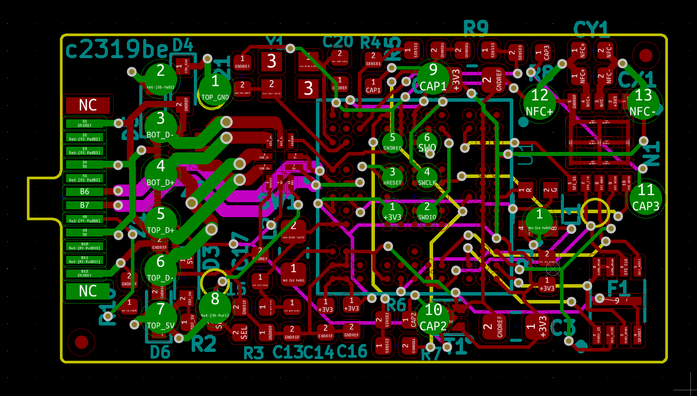

# Solo v2 Hardware

This repo contains the schematic and layout for Solo v2.  Specifically, it contains the Kicad source files
for the "module" PCB which contains all of the relevant circuitry.

What is not included is the "cavity" PCBs, or NFC antenna.

To generate a BOM, see [`bom/`](./bom).

This is only provided as a reference.  If you'd like to submit a PR or otherwise provide feedback, please contact SoloKeys team first.
